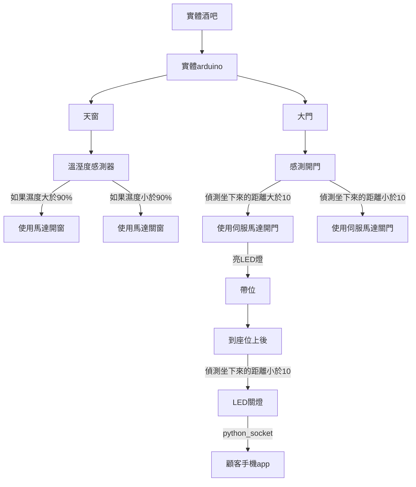
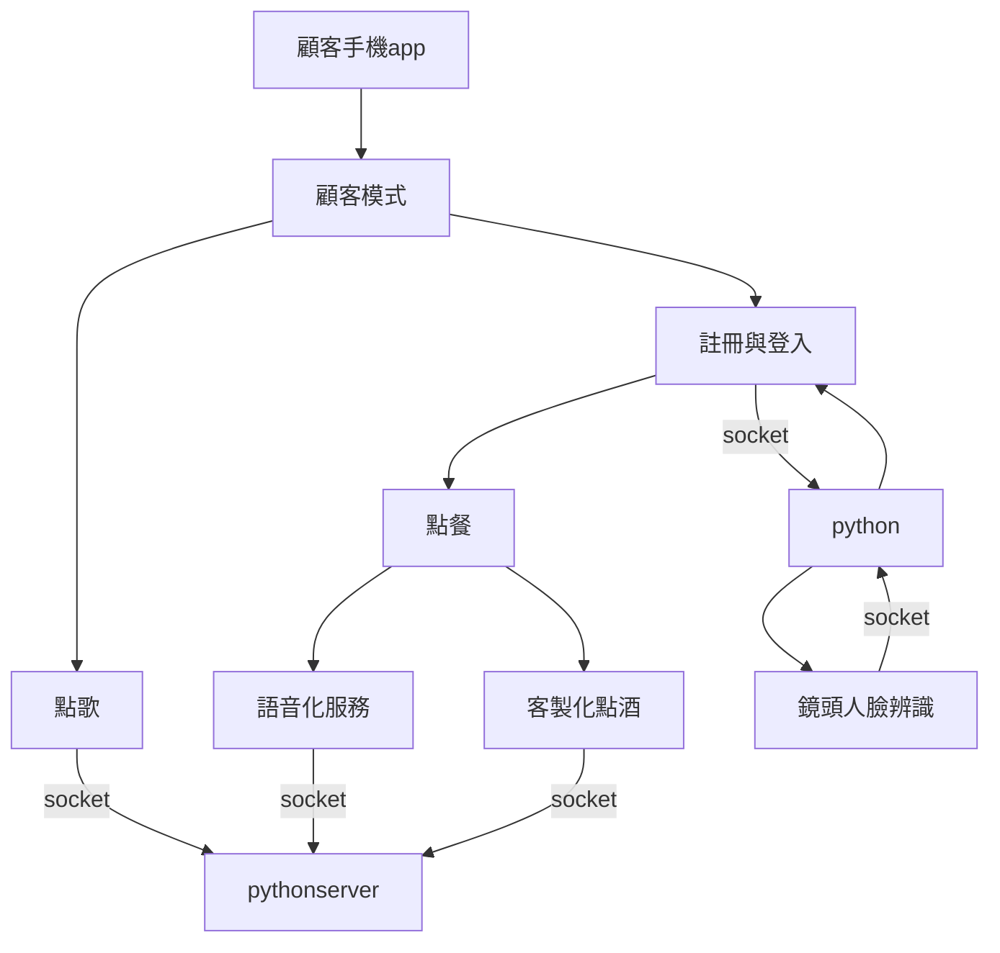
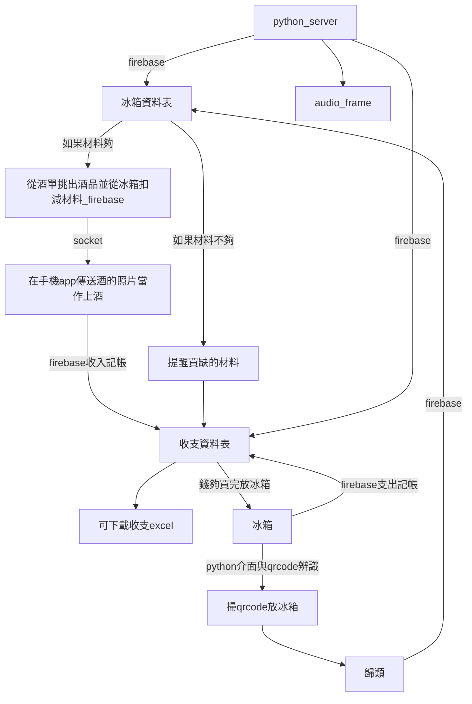

# 專題架構圖

###### tags: `資工`

## 主要架構與技術
分成硬體與軟體

### 硬體
* arduino
* linklt 7697
* 鏡頭
### 軟體
* Server：python GUI
* Client：android app
* Database：firebase

### 使用技術
* android
    * app
    * socket client
    * speech ai
    * 註冊跟VIP辨識
* python
    * socket server
    * 點擊.bat檔即可執行server程式。
    * tkinter
    * open cv qrcode
    * opencv 人臉辨識
    * read qr code
    * python download csv
* database
    * firebase

## 硬體架構

## 點餐App 
### 程式架構

### 點餐 app 架構

#### 一開始畫面：
坐下來後才能開始使用app

#### 第二個畫面：
註冊與登入

#### 第三個畫面：

* 語音化服務按鈕
* 點餐頁面按鈕

#### 語音化畫面
透過語音化跟傳送socket到server，再傳到資料庫，然後再透過socket傳送到app。

#### 點擊畫面
* 一般點酒按鈕
    * 顯示菜單(手動)
* 客製化按紐
    * 酸或甜
    * 重還輕

py->android 用json 傳送
android -> py用文字傳送
## 內場架構

## 時程表

### 第一次開會(5/8)

* 完成 大門與帶位的arduino(功能建立)
* python GUI 撰寫完成
* python GUI 能夠串接firebase資料庫
* python GUI 能下載csv
* python GUI opencv qrcode 圖像辨識

### 第二次開會
* android app 撰寫完成
* ANDROID APP 客製化點酒
* 完成 android app socket 連接 python GUI
* 語音化訊息處理
* arduino 偵測坐下後才能用app點餐
* opencv 人臉辨識

### 第三次開會
* android app點歌與python 串接 youtube點歌

### 第四次開會
* 天窗 arduino 處理(功能建立)
* 實行美工，將所有硬體安裝進模型裡面。

## 未來展望
* 搭配line bot

## 製作困難

### 5/8
如何數位雙聲？

使用ppt，同步操作demo

### 5/17 

人臉辨識如何儲存隨時有人註冊後更新模型？

解決方式：使用pickle套件

### 5/19
如何在server gui顯示來自socket的訊息？

解決方式：開多執行緒
