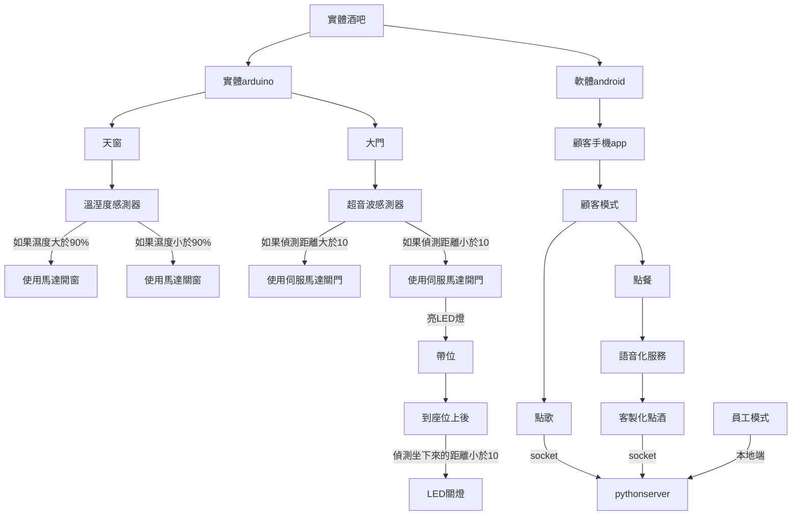
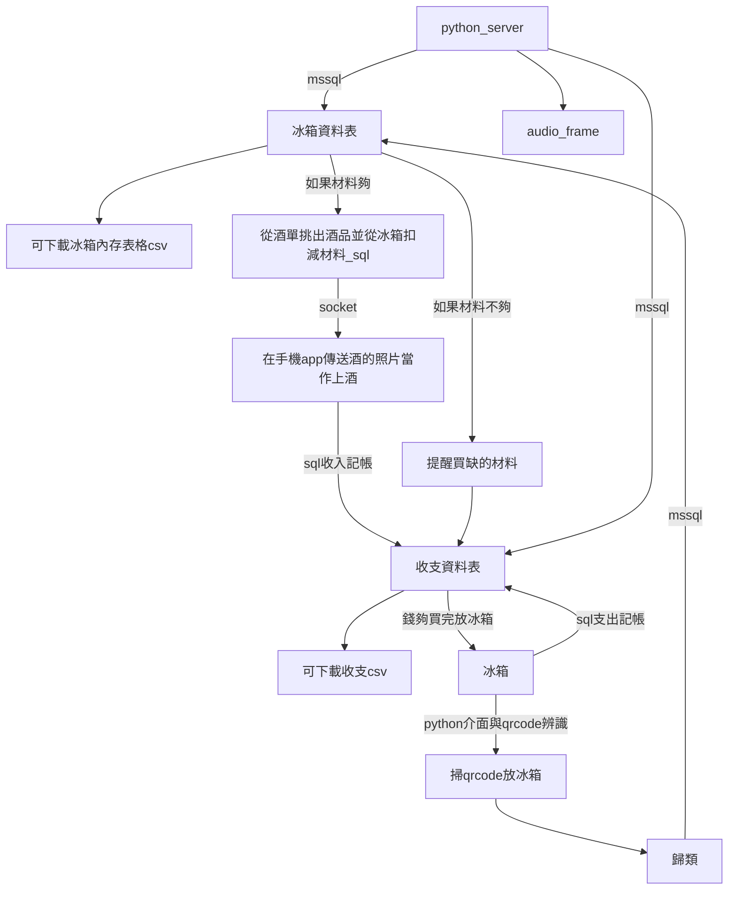

# 專題架構圖

###### tags: `資工`

## 主要架構與技術
分成硬體與軟體

### 硬體
* arduino
* linklt 7697
### 軟體
* Server：python GUI
* Client：android app
* Database：firebase

### 使用技術
* android
    * app
    * socket client
    * speech ai
* python
    * socket server
    * 點擊.bat檔即可執行server程式。
    * tkinter
    * open cv
    * read qr code
    * python download csv
* database
    * firebase

## 外場架構

## 內場架構

## 時程表

### 第一次開會(5/8)

* 完成 大門與帶位的arduino(功能建立)
* python GUI 撰寫完成
* python GUI 能夠串接firebase資料庫
* python GUI 能下載csv
* python GUI opencv qrcode 圖像辨識

### 第二次開會
* android app 撰寫完成
* ANDROID APP 客製化點酒
* 完成 android app socket 連接 python GUI
* 語音化訊息處理

### 第三次開會
* android app點歌與python 串接 youtube點歌

### 第四次開會
* 天窗 arduino 處理(功能建立)
* 實行美工，將所有硬體安裝進模型裡面。

